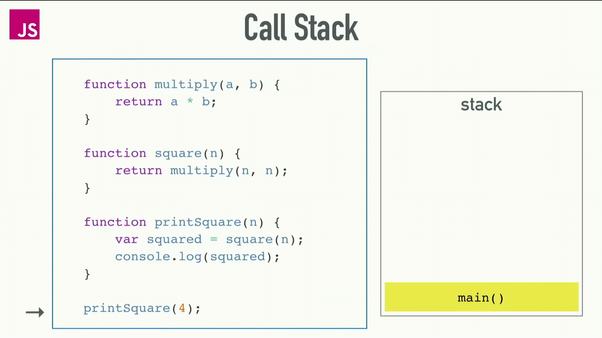

## Event Loop(цикл событий)

Так-как JavaScript является однопоточным языком, то-есть в текущий момент времени может выполняться только один фрагмент кода, пока текущий фрагмент кода не будет выполнен, то мы не сможем приступить к выполнению следующего кода. Тут возникает вопрос: Как в однопоточном JavaScript выполнять код в многопоточном или асинхронном режиме. И в этом нам помогает механизм `Event loop(цикл событий)` который нам предоставляет браузер.

События, таймеры, запросы Ajax предоставляются браузерами на стороне клиента и часто называются Web API. Они не являются основной частью реализации JavaScript, JavaScript строго соответствует спецификациям EcmaScript и его различным версиям.
Именно они позволяют однопоточному JavaScript быть неблокирующим, параллельным и асинхронным.

В рабочем процессе выполнения любой программы JavaScript есть три основных раздела: `Call Stack(стек вызовов)`, `Web API` и `Task Queue(очередь задач)`.

### The Call Stack(стек вызовов)

Стек это структура данных, в которой последний добавленный элемент всегда первым удаляется из стека. Можно представить это как стек тарелок, в которой только первая тарелка, которая была добавлена последней, может быть удалена первой.
`Call Stack(стек вызовов)` это не что иное, как стековая структура данных, в которой выполняются задачи или код.


Когда вызывается функция `printSquare()`, она помещается в стек вызовов, функция `printSquare()` вызывает функцию `square()`. Функция `square()` помещается в стек и вызывает функцию `multiply()`. Функция `multiply()` помещается в стек. Поскольку функция `multiply()` возвращается и является последней, которая была помещена в стек, она разрешается первой и удаляется из стека, за ней следует функция `square()`, а затем функция `printSquare()`.

### Web API

Именно здесь выполняется код, который не обрабатывается движком V8, чтобы не `блокировать` основной поток выполнения.

```JavaScript
console.log(1)
setTimeout(() => {
  console.log(2)
}, 0);
console.log(3)
```

Когда мы запускаем код, `console.log(1)` и `console.log(3)` выталкиваются в стек, и мы получаем наш вывод почти сразу же, таймеры обрабатываются браузером и не является частью основной реализации `V8`, вместо этого они выталкиваются в `Web API`, освобождая стек, чтобы он смог выполнять другие операции.

Пока `setTimeout` все еще выполнятся, стек переходит к следующей строке и запускает последний `console.log(3)`, что объясняет, почему мы получаем этот вывод перед выводом таймера. Как только таймер завершится, `console.log(2)` снова появляется в стеке вызовов!.

### Task Queue(очередь задач)

`Task Queue` или очередь задач это структура данных, которая позволяет выполнять асинхронные задачи. Если приложению необходимо выполнить работу в фоновом режиме, оно добавляет задачи в очереди задач. В отличии от `Call Stack` выполняет задачи по принципу `первым пришел, первым ушел`.

Давайте рассмотрим наглядную визуализацию этого кода:

```JavaScript
const foo = () => console.log("First");
const bar = () => setTimeout(() => console.log("Second"), 1000);
const baz = () => console.log("Third");

bar();
foo();
baz();
```


При запуске этого кода в стек вызовов попадет функция `bar()`, вызывается и удаляется из стека, но `setTimeout` который внутри функии `bar()` не выполниться, а попадет в `Web API`. Потом `Web API` начнет выполнять отчет таймера который мы указали вторым параметром в `setTimeout`(в нашем случае 1 секунда) и после завершения таймера callback функция, которая была указана первым параметром в `setTimeout` будет отправлена в `очередь задач`.

Пока выполнялся наш `setTimeout` браузер продолжал выполнение нашего кода.

Далее вызов функции `foo()` поместит ее в `Call Stack` и выведет в консоль браузера `"First"` и `Call Stack` отчищается. Далее идет `baz()`, функция помещается в `Call Stack` выполняет `console.log("Third")` и в консоли браузера видим `"Third"` и `Call Stack` отчищается.

В это время callback вызов который находится в `очереди задач` будет ждать пока `Call Stack` не станет пустым и после выполнит наш `console.log("Second")` и консоль браузера покажет нам `"Second"` и `Call Stack` отчищается.

В итоге видим в консоли такую последовательность: "First" "Third" "Second".
